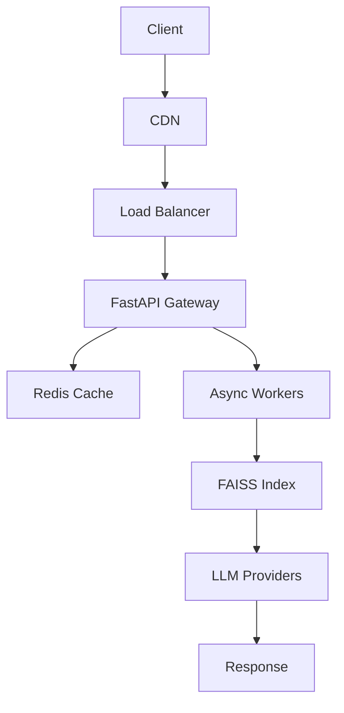

<h1 align="center">Devesh Chauhan</h1>

  <b>Backend Engineer specializing in high-concurrency distributed systems and AI infrastructure</b>

  Engineered systems handling <b>~850+ req/sec</b> with <b>sub-500ms latency</b> under real-world production load

  

---

## Engineering Activity

  
  

---

## What I Build

* High-concurrency backend systems (500–850+ req/sec under sustained load)
* Distributed AI systems (RAG, LLM orchestration, vector search)
* Event-driven architectures (Kafka, asynchronous pipelines)
* API-first platforms designed for integrations and automation
* Low-latency systems optimized through caching, batching, and intelligent routing

---

## Flagship System — High-Concurrency AI Platform

Production-grade distributed backend system designed to support real-world AI workloads at scale with strong performance and reliability guarantees.

### Scale

* ~850 req/sec throughput (load-tested)
* 500+ concurrent requests with stable latency
* 100K+ documents processed

### Architecture

* Async FastAPI services (stateless, horizontally scalable)
* Redis distributed caching for low-latency performance
* FAISS vector index for efficient semantic retrieval
* Kafka-based event pipelines for decoupled asynchronous processing
* Multi-LLM routing layer with intelligent fallback handling

### Engineering Decisions

* Stateless architecture enabling horizontal scalability
* Asynchronous pipelines for non-blocking execution
* Cache-first design to reduce latency and inference cost
* Backpressure handling to maintain system stability under load
* API-first architecture for extensibility and seamless integrations

### Impact

* ~40% reduction in latency
* ~30% reduction in operational cost
* Stable performance under both sustained and burst traffic conditions

---

## System Architecture

---

## Focus

* Distributed systems and system design
* High-throughput backend engineering
* AI infrastructure and LLM systems
* Performance optimization and reliability

---

## Positioning

* Backend Engineer (Distributed Systems)
* AI Infrastructure Engineer
* High-Concurrency Systems Engineer
