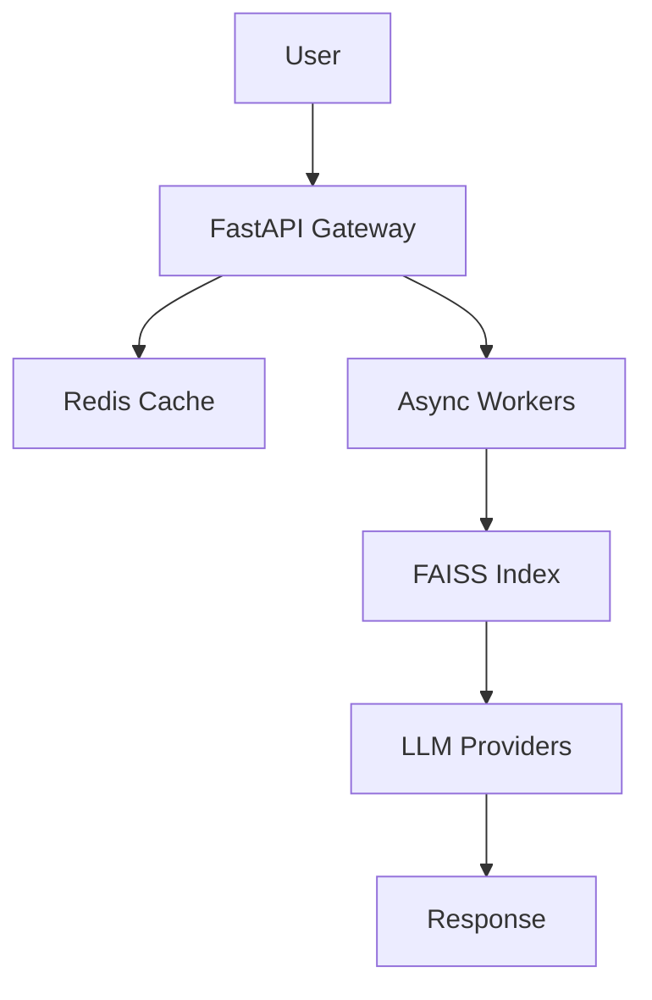

# <h1 align="center">Devesh Chauhan</h1>

  <strong>AI Backend Engineer • Distributed Systems • LLM Infrastructure</strong>

  Building production-grade AI systems handling real-world scale, latency, and concurrency

  <strong>1K+ concurrent users</strong> • <strong>100K+ documents</strong> 
  <strong>Latency ↓ 40%</strong> • <strong>Cost ↓ 30%</strong>

  
  
  

---

## About

I am a backend engineer focused on building scalable AI infrastructure and distributed systems.

I specialize in:

* High-concurrency backend systems
* Retrieval-Augmented Generation (RAG) pipelines
* Low-latency inference optimization
* Production-grade LLM infrastructure

I design systems that are scalable, fault-tolerant, and efficient under real-world load.

Proven through real systems:

* 100K+ documents processed
* 1K+ concurrent requests handled
* 40% latency reduction
* 30% cost optimization

---

## Key Work

### Distributed AI Backend System

A production-grade backend architecture for scalable AI workloads.

**Scale**

* 100K+ documents indexed
* 1K+ concurrent users

**Architecture**

* Async FastAPI services
* Redis distributed caching
* FAISS vector retrieval
* Multi-LLM orchestration layer

**Key Engineering Decisions**

* Stateless services for horizontal scaling
* Async pipelines for non-blocking performance
* Cache-first design to reduce inference cost
* Optimized vector search for faster retrieval

**Impact**

* p95 latency reduced by 40%
* inference cost reduced by 30%
* stable under sustained concurrency

---

## System Architecture

---

## Technical Strength

### Backend and Distributed Systems

* Python, FastAPI, Node.js
* Async system design and concurrency handling
* Stateless microservice architecture

### AI Systems

* Retrieval-Augmented Generation (RAG)
* OpenAI, HuggingFace, multi-LLM routing
* Local LLM inference (Ollama)

### Data and Retrieval

* FAISS, ChromaDB (vector search)
* PostgreSQL, MongoDB
* Embedding pipelines and semantic search

### Infrastructure

* Dockerized deployments
* AWS (EC2, S3)
* CI/CD workflows

---

## Selected Projects

### EnterpriseRAG AI

Multi-tenant RAG system handling 100K+ documents with low-latency retrieval

### AI Research Copilot

Citation-aware AI system improving response accuracy by 35%

### OmniChat AI

Multi-LLM backend handling 500+ parallel requests, reducing cost by 30%

### IntelliDocs AI

Semantic document intelligence system across large datasets

### WebInsight Automator

Async pipeline processing 10K+ pages per day

---

## Engineering Mindset

* Systems over syntax
* Performance-first design
* Build, measure, optimize
* Real-world scalability focus
* Clean and modular architecture

---

## Why Me

* Built real systems at scale, not just academic projects
* Strong foundation in data structures and system design
* Experience with production AI infrastructure
* Proven ability to optimize performance and cost
* Consistent engineering discipline

---

## Contact

* Portfolio: [https://developerdevesh.vercel.app](https://developerdevesh.vercel.app)
* LinkedIn: [https://linkedin.com/in/devesh-chauhan-6b5691308](https://linkedin.com/in/devesh-chauhan-6b5691308)
* LeetCode: [https://leetcode.com/u/devloperdevesh](https://leetcode.com/u/devloperdevesh)

---

## Final Statement

I focus on building scalable AI systems that work in production, optimized for performance, reliability, and real-world impact.
